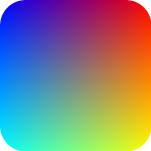

# Magick Round Corners 

This is a simple ruby gem that adds the instance method `round_corners`
transformation to `Magick::Image` class.

## Installation

    gem install magick_round_corners

or you can also can add it to you Gemfile

    gem 'magick_round_corners'

## Using it

Given an instance of `Magick::Image`, `image`, you can call `image.round_corners(RADIUS)`
where `RADIUS` is the desire radius to round the corners.  

Yes, it is just like that!, Easy? No?

## Dependency

* `rmagick`

## Example

This example use

To generate

    :001 > require 'rmagick'
        => true 
    :002 > require 'magick_round_corners'
        => true 
    :003 > image = Magick::Image.read('sample.png').first
        => sample.png PNG 300x300 300x300+0+0 DirectClass 8-bit 976b 
    :004 > rounded_corners_image = image.round_corners(50)
        => sample.png PNG 300x300 300x300+0+0 DirectClass 8-bit 
    :005 > rounded_corners_image.write('output.png')
        => sample.png=>output.png PNG 300x300 300x300+0+0 DirectClass 8-bit 
        
# Friendly reminder

When saving/writing out your rounded images, **use** an extension that supports **transparencies** (a.k.a this will not generate rounded jpg images)
